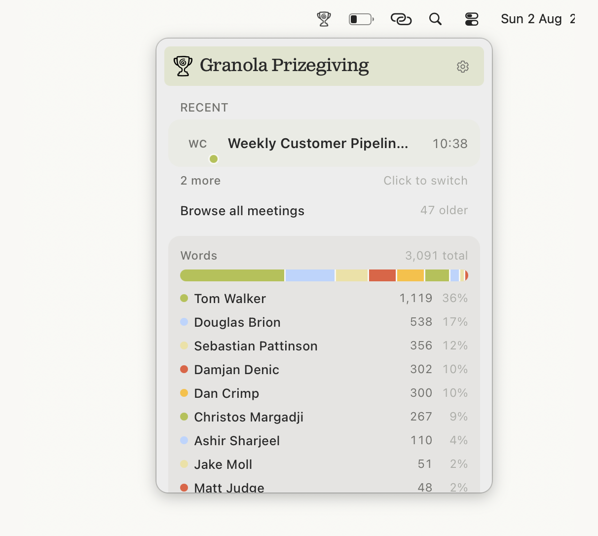
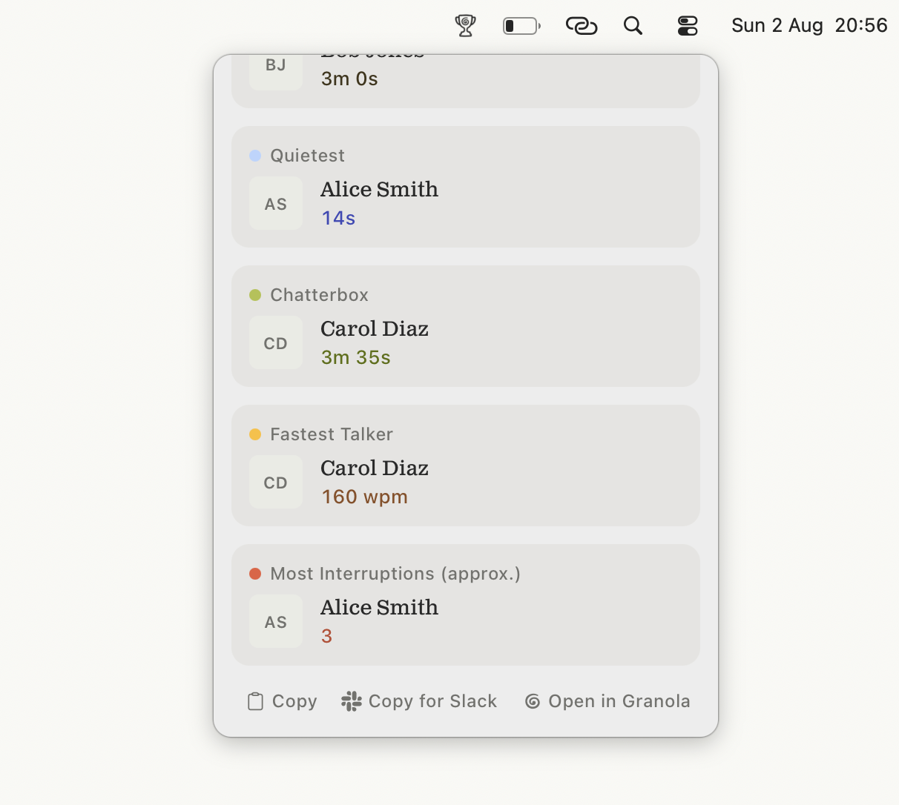

<p align="center">
  
</p>

<h1 align="center">Granola Prizegiving</h1>

<p align="center">
  <em>A macOS menu bar app that turns meeting transcripts into tongue-in-cheek talk-time awards.</em>
</p>

<table align="center">
  <tr>
    <td align="center" width="50%">
      
      <br />
      <sub>Talk-time leaderboard</sub>
    </td>
    <td align="center" width="50%">
      
      <br />
      <sub>Awards</sub>
    </td>
  </tr>
</table>

---

Recently became aware of the Granola API, which allows users to fetch notes and diarised transcripts. Simultaneously found myself monologuing super hard in a meeting at work. Been wanting to try my hand at building a MacOS menu bar item for a while and thought this would be a good opportunity. Have got Claude to scaffold out a simple project for me to add to.

Idea is to parse the transcript and hand out (heavily tongue-in-cheek) awards to meeting participants post-meeting, thinking:

- **Chatterbox** - biggest talker, both word count and total time spoken
- **Monologuer** - longest monologue
- **Interruption Machine** - who cuts across people mid sentence
- **Favourite words**
- **Buzzword detector**
- etc...

## Prerequisites

macOS only. You'll need:

- **macOS 11+**
- **Xcode Command Line Tools** — `xcode-select --install`
- **Node.js 20+** (LTS is fine; npm comes with it)
- **Rust** via [rustup](https://rustup.rs) — stable, **1.77.2+** (`rustc --version` to check)

You'll also want a [Granola API key](https://docs.granola.ai) from your workspace settings if you're hitting the real API. You can paste it in the app under **Settings…** (tray menu or the gear in the popover). Mock fixtures are available from the same window.

First-time Rust compile of the Tauri shell is slow; subsequent runs are much quicker.

## Setup

```
npm install
npm run dev            # tray icon + popover — use this, not the Vite URL in a browser
```

Then open **Settings…** (right-click the tray icon, or the gear in the popover), paste your API key, and save. Optional: `cp .env.example .env` to seed Settings on first launch.

The real API only works inside the Tauri shell (`npm run dev` or the built `.app`).
Granola’s CORS preflight 404s, so opening `localhost:1420` in Safari/Chrome will fail;
use Settings → Mock data (or Storybook) for browser-only work.

Other commands: `npm run check` (lint + typecheck), `npm run test`
(Vitest), `npm run storybook`, `npm run build` (macOS `.app` / DMG).

## Status

- Started: AI generated project scaffold: API client, speaker stats, awards logic
- Done: Design tokens aligned to Granola's public `oats` system (`src/styles/tokens.css`)
- Todo: Component styling pass consuming those tokens
